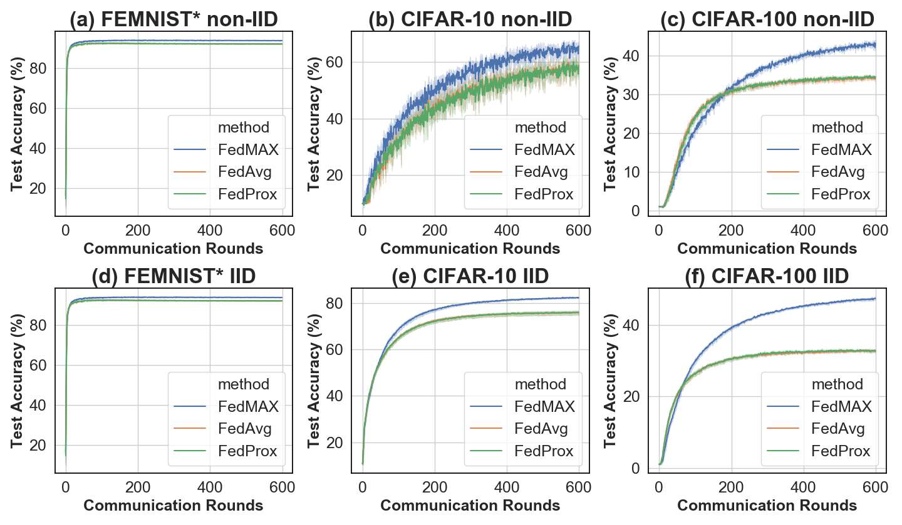

# FedMAX
Source code for ECML-PKDD paper: FedMAX: Mitigating Activation Divergence for Accurate and Communication-Efficient Federated Learning


## Preparation

### Datasets
1. FEMNIST*: The datasets is created from EMNIST, but sometimes torchvision fails to download the dataset. 
The datasets can be found from the following link: 
https://www.westernsydney.edu.au/icns/reproducible_research/publication_support_materials/emnist.  
Once the dataset is downloaded, it can be place at "./digit_object_recognition/datasets/emnist"

2. Chest X-ray: The datasets is from Kaggle with the link: https://www.kaggle.com/paultimothymooney/chest-xray-pneumonia.   
Place the dataset at "./medical_data/chest_xray"

3. APTOS: The datasets is from Kaggle with the link: https://www.kaggle.com/tanlikesmath/diabetic-retinopathy-resized and 
https://www.kaggle.com/c/aptos2019-blindness-detection/data.   
Place the dataset at "./medical_data/inputs" and construct the directory as follows:  
```commandline
|–– inputs  
|    |–– diabetic-retinopathy-resized/  
|    |–– test_images/  
|    |–– train_images/  
|    |–– train.csv  
|    |–– test.csv
```

### Download dependencies
```commandline
pip install -r requirements.txt
```


## Training

It implements experiments on three digit/object recognition datasets: FEMNIST*, CIFAR10, and CIFAR100 (both IID and non-IID).
It also implements experiments on two medical datasets: APTOS and ChestXray

Our code is supposed to run in the GPU.

### Digit/object recognition datasets:
```commandline
cd ./digit_object_recognition
bash run.sh
```
The regularization method can be identified via '--loss_type': 'none' represents FedAvg, 'fedprox' represents FedProx, 
'fedmax' represents FedMAX, 'l2' represents L2 norm.

The '--beta' of FedMAX can be 1000, '--mu' of FedProx can be 1.

Please refer to run.sh file to change the arguments

### Medical datasets:
```commandline
cd ./medical_data
bash run.sh
```
In the arguments, if '--beta' is 0, it's FedAvg. For APTOS dataset, we use '--beta 10000'; for Chest X-ray, we use '--beta 1000'. 

Please refer to run.sh file to change the arguments

## Results
For example, the result of digit/object recognition dataset can be shown as follows:  


We can see the better performance of FedMAX.

## Reference

FedMAX: https://arxiv.org/abs/2004.03657

### Citation
@misc{chen2020fedmax,
    title={FedMAX: Mitigating Activation Divergence for Accurate and Communication-Efficient Federated Learning},
    author={Wei Chen and Kartikeya Bhardwaj and Radu Marculescu},
    year={2020},
    eprint={2004.03657},
    archivePrefix={arXiv},
    primaryClass={cs.LG}
}
